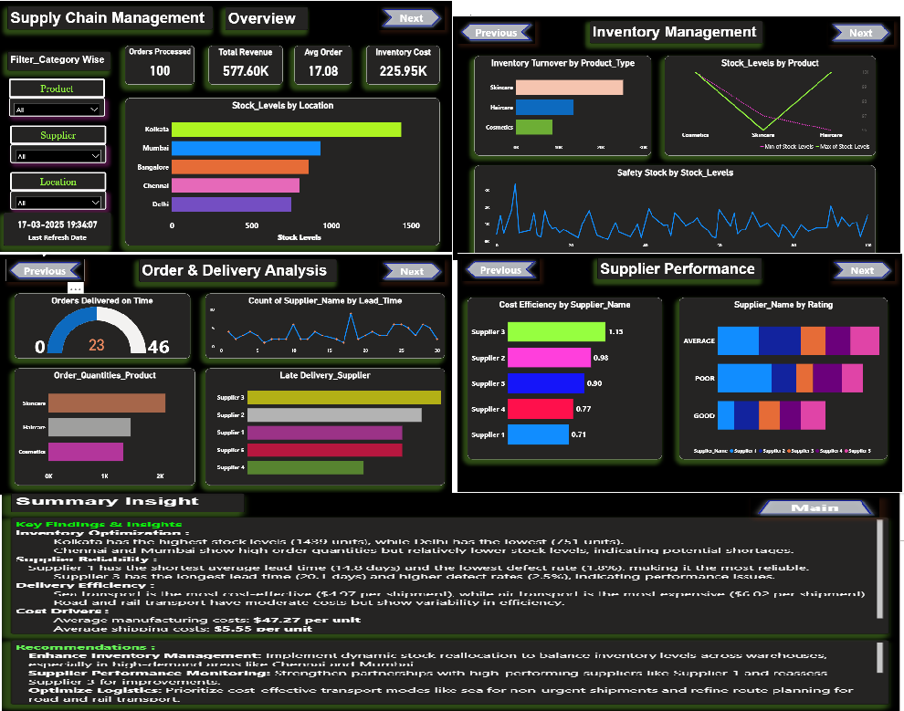

🚚 Supply Chain Management Dashboard (Power BI)
An interactive Power BI dashboard designed to manage and monitor supply chain operations in the healthcare, skincare, and cosmetics industries.
It provides actionable insights into inventory, suppliers, demand forecasting, and logistics to help reduce costs, improve delivery times, and enhance customer satisfaction.

📌 Overview
This dashboard consolidates supply chain data into a single, visually interactive platform, enabling real-time analysis of key operational metrics.
It supports better decision-making for:

Inventory optimization
Supplier Relaiblity
Delivery Efficiency
Cost Drivers

🛠 Tools & Technologies
Power BI (Data modeling, DAX, Interactive visuals)

Data Sources: Excel/CSV

DAX Measures for KPI calculations

Data Cleaning & Transformation in Power Query

🚀 How to Use
Open the .pbix file in Power BI Desktop

Refresh data sources (Excel/CSV/Database)

Use slicers to filter by:

Industry segment (Healthcare, Skincare, Cosmetics)

Product
Supplier
Location

Review KPIs and insights on:
Inventory Overview
Supplier Dashboard

📸 Dashboard Preview
 

Replace with actual screenshots of your Power BI report pages.

📢 Author
Created by **[Girish Kumar V](https://github.com/GirishKumarV25)** – Passionate about **data analytics, visualizations**.
